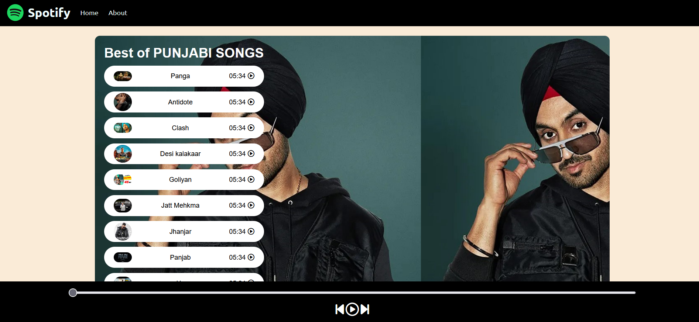

## 🎵 Spotify Clone

This project is built to replicate the core functionalities and sleek design of the original Spotify music streaming platform. It allows users to browse music, play/pause tracks, and explore playlists and responsive UI. The main goal of this project is to demonstrate front-end development skills, UI/UX design, and integration of music-related features using modern technologies.

### 🔧 Features:

* Browse and play music
* Interactive UI inspired by Spotify
* Responsive design for all screen sizes
* Smooth animations and transitions

### 🛠️ Tech Stack:

* **Frontend:** HTML, CSS, JavaScript 

This project is for educational and portfolio purposes only. It does not use Spotify's proprietary code or backend services.

